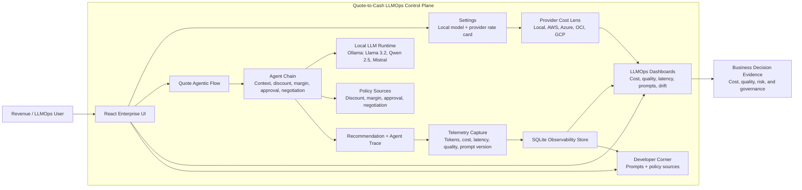

<!--
  Enterprise README for the Quote-to-Cash LLMOps Control Plane.

  Author: Sarala Biswal
-->

# Quote-to-Cash LLMOps Control Plane

**Author:** Sarala Biswal

Quote-to-Cash LLMOps Control Plane is a standalone enterprise application for demonstrating how production teams manage LLM cost, quality, latency, prompt governance, and drift in an agentic business workflow. The primary use case is a **Quote-to-Cash Agentic Flow** where multiple revenue agents analyze a renewal opportunity, produce quote guidance, and emit live observability telemetry from the same run.

## Business Problem

Enterprises are moving LLMs from prototypes into revenue workflows such as quoting, renewals, discount approvals, and negotiation support. These workflows are high impact: a poor recommendation can leak margin, route the wrong approval, delay a deal, or create inconsistent customer messaging.

The operational problem is that most teams cannot answer production-grade questions clearly:

- How much did this agent flow cost?
- Which model, prompt version, and provider rate card were used?
- Did quality stay above the required threshold?
- Were latency SLOs met?
- Did output behavior drift from the approved baseline?
- Which policy and prompt produced the recommendation?
- Can business leaders trust the final quote recommendation?

Without this control plane, LLM-enabled Quote-to-Cash work feels like a static demo or an opaque assistant. Enterprises need a way to connect the business decision to the telemetry, policy, and runtime evidence behind it.

## Solution Provided

This app turns the Quote-to-Cash scenario into a governed agentic workflow and an LLMOps observability cockpit.

A user selects a realistic revenue opportunity and runs the Quote-to-Cash agent flow. The app executes agent steps for opportunity context, discount policy, margin risk, approval routing, and negotiation guidance. Each step records model, provider, token usage, cost, latency, quality score, prompt version, and policy context.

The same run updates the dashboards for:

- **Cost Impact:** token economics, selected provider rate card, local model execution cost, and optimization recommendations.
- **Quality Evidence:** faithfulness, relevance, coherence, hallucination checks, and quality gates.
- **Latency SLOs:** response-time distribution, p95/p99 behavior, and breach visibility.
- **Prompt Governance:** prompt versions, comparison data, and rollout evidence.
- **Drift & Alerts:** semantic drift, threshold status, and operational alert history.
- **Developer Corner:** actual prompts and policy documents used by each Quote-to-Cash agent.

The result is a realistic story: the business sees the quote recommendation, while engineering and operations see the cost, quality, latency, and governance evidence needed to run that workflow in production.

## Core Use Case

### Quote-to-Cash Agentic Flow

The flow simulates an enterprise revenue desk reviewing renewal and expansion opportunities. It produces:

- Renewal risk summary
- Recommended discount
- Margin risk assessment
- Approval route recommendation
- Negotiation guidance
- Customer-facing quote language
- Observability trace for each agent step

The flow is intentionally multi-agent so one business action creates many LLM calls and prompts. That makes token economics, prompt governance, quality measurement, and latency analysis visible in a way that mirrors real production systems.

## Runtime Model Strategy

The default runtime is local-first:

- **Provider:** Local LLM
- **Default model:** Llama 3.2 through Ollama
- **Other local model choices:** Qwen 2.5 and Mistral

The Settings page also includes AWS, Azure, OCI, and Google Cloud provider options as cost-planning rate cards. When a cloud provider is selected, the app continues to execute the task locally unless live cloud integration is configured, but cost calculations use the selected provider rate card. This keeps the demo standalone while still showing realistic cloud cost impact.

## Application Modules

| Area | Purpose |
|---|---|
| About | Explains the business problem, solution, and app operating model. |
| Quote Agentic Flow | Runs the Quote-to-Cash workflow and creates live telemetry. |
| Cost Impact | Shows token usage, spend, provider rate-card impact, and optimizer recommendations. |
| Quality Evidence | Tracks quality scores, hallucination signals, and gate outcomes. |
| Latency SLOs | Monitors latency distribution and SLO risk. |
| Prompt Governance | Shows prompt versions, comparison metrics, and rollout status. |
| Drift & Alerts | Detects semantic drift and displays alert posture. |
| Architecture | Explains the technical architecture, runtime path, and system diagram. |
| Settings | Selects local model and provider cost lens. |
| Developer Corner | Shows the actual prompts and policy sources used by the agent flow. |

## Architecture Overview

The app has three major layers:

- **React enterprise UI:** A Vite and TypeScript dashboard for business review, LLMOps controls, runtime settings, and developer inspection.
- **FastAPI observability API:** Routes for ingestion, cost, quality, latency, prompts, drift, alerts, and the Quote-to-Cash workflow.
- **Domain and telemetry services:** Quote-to-Cash agents, local/mock/provider LLM abstraction, token tracking, cost calculators, quality scoring, drift scoring, and SQLAlchemy persistence.



Every Quote-to-Cash run follows this path:

```text
Opportunity selection
  -> Quote-to-Cash agent chain
  -> Local/mock/provider LLM execution
  -> Recommendation and trace
  -> LLM call records
  -> Cost, quality, latency, prompt, drift, and alert dashboards
```

## Technology Stack

| Layer | Technology |
|---|---|
| API | FastAPI, Pydantic v2 |
| Persistence | SQLite, SQLAlchemy async |
| Local LLM | Ollama |
| Optional LLM path | LiteLLM/OpenAI-compatible execution |
| Cost | Provider rate cards and token-based calculators |
| Quality | Deterministic scoring plus optional judge path |
| Drift | Embedding similarity and threshold-based alerts |
| Metrics | Prometheus-compatible `/metrics` endpoint |
| UI | React 18, Vite, TypeScript, Recharts, Lucide |
| Tests | pytest, pytest-asyncio, Playwright, TypeScript build |

## Quick Start

Install dependencies and seed the local database:

```bash
make install
ollama pull llama3.2
make seed
```

Install all local models shown in Settings:

```bash
ollama pull llama3.2
ollama pull qwen2.5:7b
ollama pull mistral
```

The app defaults to `llama3.2`. Select `qwen2.5:7b` or `mistral` in **Settings** when you want to compare local model cost, quality, and latency behavior.

Run the API:

```bash
make dev-api
```

Run the UI in another terminal:

```bash
make dev-ui
```

Default local endpoints:

- API: `http://localhost:9100`
- UI: `http://localhost:5173`

## API Examples

List Quote-to-Cash opportunities:

```bash
curl -s http://localhost:9100/revenue-desk/opportunities
```

Run the agentic quote flow:

```bash
curl -s -X POST http://localhost:9100/revenue-desk/analyze \
  -H 'Content-Type: application/json' \
  -d '{
    "opportunity_id": "RCC-OPP-001",
    "prompt_version": "v2.2",
    "model_mode": "ollama",
    "local_model": "llama3.2",
    "approval_guardrails_enabled": true
  }'
```

Inspect actual prompts and policy sources:

```bash
curl -s "http://localhost:9100/revenue-desk/developer/prompts?opportunity_id=RCC-OPP-001&prompt_version=v2.2&approval_guardrails_enabled=true"
```

## SDK Integration

External applications can instrument their LLM calls through the collector middleware and decorator:

```python
from collector import ObservabilityMiddleware, track_llm_call

app.add_middleware(
    ObservabilityMiddleware,
    collector_url="http://localhost:9100",
    use_case="quote_to_cash",
)

@track_llm_call(use_case="renewal_agent", prompt_version="v2.2")
async def generate_quote_guidance(context: dict) -> str:
    ...
```

## Validation

Run backend tests:

```bash
uv run pytest -q
```

Run focused Quote-to-Cash tests:

```bash
uv run pytest -q tests/test_revenue_desk.py
```

Build the frontend:

```bash
cd ui
npm run build
```

Run the Playwright smoke test:

```bash
cd ui
npx playwright test phase12-smoke.spec.ts
```

## Enterprise Value

This app is designed to communicate a practical LLMOps message: an enterprise should not evaluate an agent only by whether it produces a polished answer. The production question is whether the organization can observe, govern, tune, and trust the full flow.

Quote-to-Cash LLMOps Control Plane demonstrates that answer with one coherent business story: a revenue workflow runs, multiple LLM calls happen, cost and quality are measured, policy is applied, prompts are inspectable, drift is tracked, and the final recommendation is tied back to evidence.
