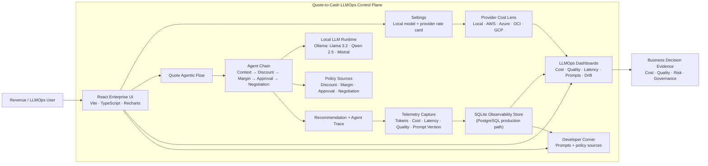

<!--
  Author: Sarala Biswal
  github.com/saralabiswal
-->

# Quote-to-Cash LLMOps Control Plane

**Author:** [Sarala Biswal](https://github.com/saralabiswal) · [LinkedIn](https://linkedin.com/in/saralabiswal) · [nlpml.ai](https://nlpml.ai)

> Production observability for LLM-powered revenue workflows — token economics,
> quality governance, latency SLOs, prompt versioning, and semantic drift detection,
> tied to a live Quote-to-Cash agentic flow.

[](https://python.org)
[](https://fastapi.tiangolo.com)
[](https://react.dev)
[](LICENSE)
[](/.github/workflows/ci.yml)

---

## The Problem This Solves

Enterprises moving LLMs into revenue workflows — quoting, renewals, discount approvals,
negotiation support — cannot answer the production questions that matter:

| Question | Without this platform |
|---|---|
| How much did this agent run cost? | Unknown — no token attribution |
| Which model and prompt version ran? | Unknown — no governance trail |
| Did quality stay above threshold? | Unknown — no scoring in production |
| Were latency SLOs met? | Unknown — no percentile tracking |
| Did output behaviour drift from baseline? | Unknown — no drift detection |
| Can business leaders trust this recommendation? | Unknown — no evidence trail |

This platform answers all six — for a live, multi-agent Quote-to-Cash workflow.

---

## What It Builds

A governed Quote-to-Cash agent chain runs a realistic renewal and expansion
opportunity through five agents: opportunity context, discount policy, margin risk,
approval routing, and negotiation guidance. Every LLM call emits telemetry —
model, provider, token usage, cost, latency, quality score, prompt version, policy
context — and the same run updates six observability dashboards in real time.

The result is a coherent production story: the business sees the quote recommendation
while engineering sees the cost, quality, latency, and governance evidence required
to operate that workflow at scale.

This is the reference implementation of the LLMOps layer behind the Agentic AI
platform architecture running in production across 600+ enterprise clients at Oracle.

---

## Application Modules

| Module | What it shows |
|---|---|
| **About** | Business problem, solution architecture, operating model |
| **Quote Agentic Flow** | Runs the 5-agent Quote-to-Cash chain, emits live telemetry |
| **Cost Impact** | Token economics, provider rate-card comparison, optimizer recommendations |
| **Quality Evidence** | Faithfulness, relevance, coherence scores, hallucination signals, quality gates |
| **Latency SLOs** | p50/p95/p99 distribution, SLO compliance %, breach visibility |
| **Prompt Governance** | Prompt version registry, A/B comparison, rollout status |
| **Drift & Alerts** | Semantic drift scores, threshold alerts, operational posture |
| **Developer Corner** | Actual prompts and policy documents used by each agent step |
| **Architecture** | System diagram, runtime path, integration guide |
| **Settings** | Local model selection, provider cost-lens configuration |

---

## Architecture



**Every run follows this path:**

```
Opportunity selected
  → 5-agent Quote-to-Cash chain executes
  → Local LLM produces recommendation + trace
  → Telemetry captured per agent step
  → Cost · Quality · Latency · Prompt · Drift dashboards update
  → Business sees recommendation + evidence simultaneously
```

---

## Three-Layer Design

| Layer | Technology | Purpose |
|---|---|---|
| **React Enterprise UI** | Vite · TypeScript · Recharts · Lucide | Business dashboards, LLMOps controls, developer inspection |
| **FastAPI Observability API** | FastAPI · Pydantic v2 · SQLAlchemy async | Ingestion, cost, quality, latency, prompt, drift, workflow routes |
| **Domain + Telemetry Services** | Python · Ollama · LiteLLM | Quote-to-Cash agents, token tracking, cost calculation, quality scoring, drift detection |

---

## Runtime Strategy — Local-First

The default runtime requires no cloud credentials and no API keys:

| Setting | Default | Alternatives |
|---|---|---|
| **Provider** | Local (Ollama) | AWS · Azure · OCI · GCP (rate-card planning) |
| **Model** | `llama3.2` | `qwen2.5:7b` · `mistral` |
| **Execution** | Always local | Cloud providers show cost impact without executing remotely |

Cloud provider selections update cost calculations using real rate cards while
continuing to execute locally. This keeps the platform standalone while demonstrating
realistic production cost modelling.

---

## Quick Start

**Install dependencies and seed the database:**

```bash
make install
ollama pull llama3.2
make seed
```

**Pull all supported local models:**

```bash
ollama pull llama3.2
ollama pull qwen2.5:7b
ollama pull mistral
```

**Run the platform:**

```bash
# Terminal 1 — API
make dev-api

# Terminal 2 — UI
make dev-ui
```

| Service | URL |
|---|---|
| API | http://localhost:9100 |
| UI | http://localhost:5173 |
| Metrics | http://localhost:9100/metrics |

---

## API Reference

**List opportunities:**

```bash
curl -s http://localhost:9100/revenue-desk/opportunities
```

**Run the Quote-to-Cash agent flow:**

```bash
curl -s -X POST http://localhost:9100/revenue-desk/analyze \
  -H 'Content-Type: application/json' \
  -d '{
    "opportunity_id": "RCC-OPP-001",
    "prompt_version": "v2.2",
    "model_mode": "ollama",
    "local_model": "llama3.2",
    "approval_guardrails_enabled": true
  }'
```

**Inspect prompts and policy sources used by each agent step:**

```bash
curl -s "http://localhost:9100/revenue-desk/developer/prompts?\
opportunity_id=RCC-OPP-001&prompt_version=v2.2&approval_guardrails_enabled=true"
```

---

## SDK Integration

Drop into any FastAPI application in the portfolio to instrument LLM calls:

```python
from collector import ObservabilityMiddleware, track_llm_call

# Middleware — instruments all LLM routes automatically
app.add_middleware(
    ObservabilityMiddleware,
    collector_url="http://localhost:9100",
    use_case="quote_to_cash",
)

# Decorator — instruments individual async functions
@track_llm_call(use_case="renewal_agent", prompt_version="v2.2")
async def generate_quote_guidance(context: dict) -> str:
    ...
```

**Portfolio repos this plugs into:**

| Repo | Use case tag |
|---|---|
| [agentic-banking-llmops](https://github.com/saralabiswal/agentic-banking-llmops) | `banking_payment_risk` |
| [agentic-mcp-quote-to-cash](https://github.com/saralabiswal/agentic-mcp-quote-to-cash) | `quote_generation` |
| [agentic-cdp-mlops](https://github.com/saralabiswal/agentic-cdp-mlops) | `cdp_churn_prediction` |
| [agentops-eval-llmops](https://github.com/saralabiswal/agentops-eval-llmops) | `eval_judge` |

---

## Technology Stack

| Layer | Technology |
|---|---|
| API | FastAPI · Pydantic v2 · SQLAlchemy async |
| Persistence | SQLite (default) · PostgreSQL (production path) |
| Local LLM | Ollama (Llama 3.2 · Qwen 2.5 · Mistral) |
| Optional cloud LLM | LiteLLM / OpenAI-compatible |
| Cost modelling | Provider rate cards + token-based calculators |
| Quality scoring | Deterministic scoring + optional judge path |
| Drift detection | Embedding similarity + threshold alerts |
| Metrics | Prometheus-compatible `/metrics` endpoint |
| UI | React 18 · Vite · TypeScript · Recharts · Lucide |
| Testing | pytest · pytest-asyncio · Playwright |

---

## Validation

```bash
# Backend tests
uv run pytest -q

# Quote-to-Cash agent tests
uv run pytest -q tests/test_revenue_desk.py

# Frontend build
cd ui && npm run build

# Playwright smoke test
cd ui && npx playwright test phase12-smoke.spec.ts
```

---

## Why This Matters

Shipping an LLM agent is the easy part. Operating it in production — knowing what
it costs, whether quality is holding, whether outputs are drifting from the approved
baseline, and being able to show a business leader the evidence behind every
recommendation — is the hard part.

This platform demonstrates the operational layer most AI teams skip: the infrastructure
that makes an enterprise willing to trust an agent with a pricing decision.

---

## Portfolio Context

This repo is part of a production AI/ML platform portfolio:

| Layer | Repo |
|---|---|
| Cross-vendor MCP integration | [agentic-mcp-quote-to-cash](https://github.com/saralabiswal/agentic-mcp-quote-to-cash) |
| 6-layer governed agentic pipeline | [agentic-banking-llmops](https://github.com/saralabiswal/agentic-banking-llmops) |
| 8-stage ML platform | [agentic-cdp-mlops](https://github.com/saralabiswal/agentic-cdp-mlops) |
| LLM agent evaluation framework | [agentops-eval-llmops](https://github.com/saralabiswal/agentops-eval-llmops) |
| **LLMOps control plane** | **this repo** |

---

*Built by [Sarala Biswal](https://linkedin.com/in/saralabiswal) — Director of Engineering, AI/ML Platforms at Oracle.
Production Agentic AI · MCP · MLOps · Quote-to-Cash · 17 years at Oracle scale.*